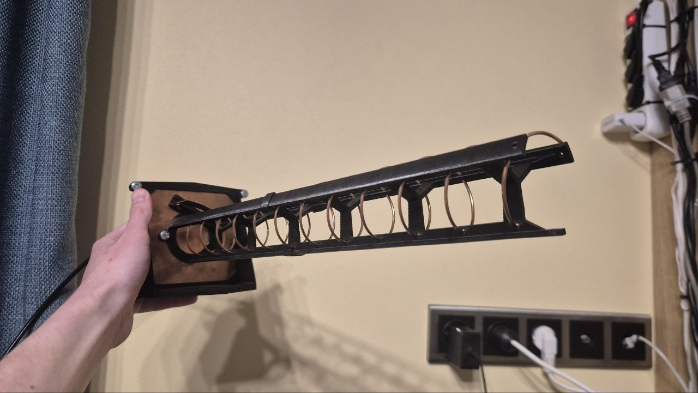

ВНИМАНИЕ! Проект не завершён, сейчас данный репозиторий используется как файловый архив для хранения чего-то вроде отчёта о работе, чтобы не перекидываться zip-архивами. По завершению проекта репозиторий будет либо полностью переработан, либо удалён.

# Спиральная антенна 2.4 ГГц

На досуге сделал спиральную антенну на 2.415 ГГц по гайдам из интернета, чтобы раздавать домашний Wi-Fi в школьный двор (живу в соседнем здании). Сейчас хочу сделать вторую антенну, чтобы присоединить её ко второму роутеру и попробовать установить радиомост между двумя удалёнными домами. Пока я не начал её делать, есть возможность выявить конструкционные недостатки, чтобы повысить эффективность второй антенны. Буду рад, если Вы мне поможете с этим.

## План-капкан

Общий план был таков:
* рассчитать параметры антенны
* в CAD сделать модельку каркаса и крепления на штатив
* распечатать на 3D принтере каркас и собрать антенну
* протестировать её

## Расчёты

Изготавливал антенну на 1-ый канал Wi-Fi диапазона под частоту 2.415 ГГц. Выбрал спиральную форму антенны, так как она не требует попадания миллиметр в миллиметр при сборке (как у волнового канала) и при этом даёт нормальное усиление.

Расчёты проводил в онлайн-калькуляторе (https://3g-aerial.biz/onlajn-raschety/raschety-antenn/raschet-spiralnoj-antenny) (см. [calc.jpg](./images/calc.jpg)). Были и другие (на английском и русском), но они все дают одинаковый результат. В них расчёты основываются на вычислении диаметра спирали так, чтобы длина витка пружины совпала с длиной волны. Шаг между витками рекомендуют брать между 0.22 и 0.25 длины волны, выбрал 0.24. Диаметр провода 2 мм. При таких параметрах обещали импеданс около 140 Ом (в тонкости расчёта не углублялся).

Итого получил:
* диаметр спирали 42 мм
* шаг спирали 30 мм
* число витков 11 (столько по высоте влезло в 2 детали на 3D-принтере)
* размер квадратного рефлектора 137 мм (не нашёл такой пластины, пришлось взять 100 мм) 

Использовал согласующую линию с 140 на 50 Ом в виде прямоугольного треугольника из медной фольги с катетами 87 и 26 мм. Понятия не имею, как она работает. Просто доверился калькулятору и челикам из интернета. Нормального объяснения так и не нашёл.

## Конструкция и сборка

В Компасе сделал модель (см. [model.png](./images/model.png), [total1.jpg](./images/total1.jpg) и [total2.png](./images/total2.jpg)). В целях упрощения моего рассказа далее не будет рассматриваться деталь для крепления антенны к штативу, скажу лишь, что рефлектор зажимается между двумя частями этой детали и далее две части стягиваются винтами. К тому же опущу механизм скрепления двух деталей траверсы между собой.

Вся конструкция стоит на 3-ёх стойках, в них сделаны отверстия под провод диаметром 2 мм (это я и назвал траверсой). Основание антенны (плоская пластиковая часть, плотно прилегающая непосредственно к рефлектору) имеет толщину 2 мм и соединяет между собой фланец, все три стойки (траверсу) и два винта M5 для крепления к рефлектору (см. [base.jpg](./images/base.jpg)). Рефлектор квадратный, толщиной 1 мм и со стороной 100 мм (см. [reflector-side.jpg](./images/reflector-side.jpg)). В нём высверлил необходимые отверстия. Сзади рефлектора прикручен фланец под коаксиальный кабель винтами M2 (см. [reflector-back.jpg](./images/reflector-back.jpg)).

Из медной фольги 0.5 мм вырезал вышеупомянутый треугольник с катетами 87 и 26 мм. С горем пополам при помощи чего-то вроде скрутки припаял острый угол треугольника и началу провода. Тупой угол припаял к центральному выходу фланца (этот припой в конце концов отвалился, мне стало лень разбирать антенну и ещё раз паять эти огромные детали, поэтому там я использую импровизированное крепление скотчем, чтобы капля припоя на треугольнике касалась выхода фланца (на фотках не показано)).

## Испытания

Коаксиальным кабелем на 50 Ом соединил антенну с роутером. На нём принудительно выбрал 1-ый канал Wi-Fi на частоте 2.4 ГГц. Выключил beamforming, MIMO и остальные приблуды. Мощность передатчика выкрутил на максимум в 100 мВт.

Направил из дома на улицу, смог выйти в интернет с расстояния 80 метров. На улице была метель и мороз, поэтому погодные условия были не лучшие и сигналу перед выходом на улицу пришлось проникать через окно. Потом вкрутил штатную антенну роутера вместо своей, словило только при 40 метрах.

Дома на расстоянии около 10 метров от роутера поставил телефон, на него установил прогу для измерения уровня приёма сигнала Wi-Fi. Вкрутил штатную антенну роутера с усилением порядка 3-5 dBi, измерил уровень приёма. Этот диполь был перпендикулярен отрезку, связывающему роутер и телефон. Потом поменял антенну на свою и измерил уровень приёма. Антенна была направлена прямо на телефон. Разница составила около 14 dBm (см. [test.jpg](./images/test.jpg)). Тогда усиление моей антенны 4 + 14 = 18 dBi, и это с учётом потерь на различия в поляризации. 18 dBi -- выше расчётного почти в два раза, без понятия, в чём проблема. Возможно барахлит приложуха на телефоне, но усиление однозначно хорошее.

## Предложения по улучшению

Надо бы усилить, вот какие идеи есть:
* добыть где-то (возможно у школы) векторный анализатор цепей или КСВ-метр, чтобы оценить потери на несогласованность антенны. Тогда можно будет сделать выводы и попробовать сменить согласующую линию на другую (а то я не понимаю как этот треугольник работает, четвертьволновой трансформатор попонятнее будет);
* изменить форму основания антенны, так как сейчас возможно в самых нужных местах рефлектор изолируется (см. [isolation.jpg](./images/isolation.jpg)) (т. е. прямо под витками антенны распространению отражённых и падающих на рефлектор волн мешает небольшой слой пластика 2мм с относительной диэлектрической проницаемостью около 3, к тому же этот слой находится и под согласующим устройством, что, возможно, нарушает его работу (принцип его работы для меня опять же загадка));
* использовать фланец с более длинным штырём и изоляцей, сейчас там возможно формируется паразитная ёмкость между штырём и рефлектором (см. [capacity.jpg](./images/capacity.jpg));
* нормально припаять согласующее устройство к началу провода, там сейчас страх (см. [horror-do-not-open.jpg](./images/horror-do-not-open.jpg));
* удлинить антенну, поскольку травеса модульная и может быть какой угодно длины, но мне кажется 11и витков уже достаточно;
* изменить какие-то исходные параметры для расчётов антенны (шаг спирали, частоту, диаметр провода), возможно слегка улучшит антенну.

Я (ещё) не эксперт в области радиотехники, поэтому значимость предложенных улучшений оценить не могу. К тому же возможно есть те недоработки, которые я не заметил. Буду рад, если Вы мне поможете с этим.

_Автор: Городилов Роман, Школа №1557_
